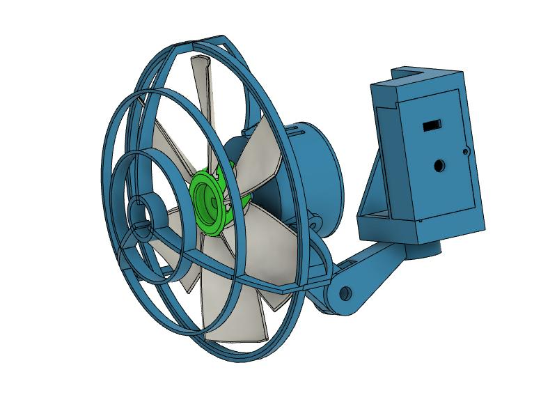
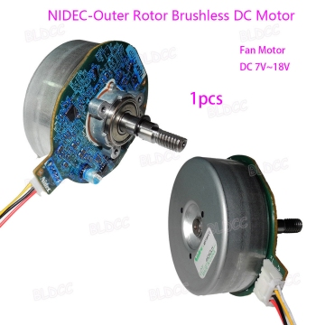
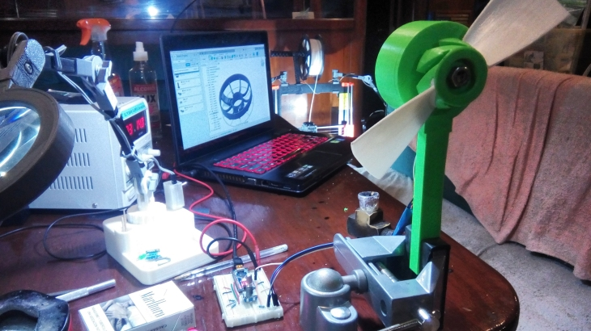
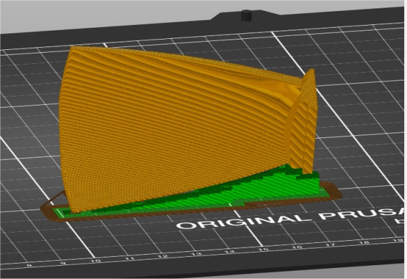
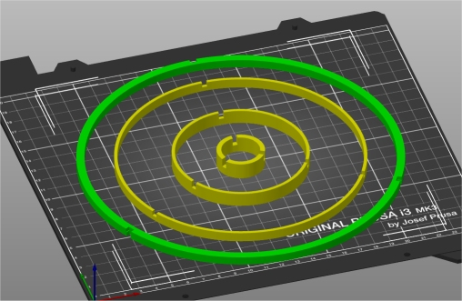
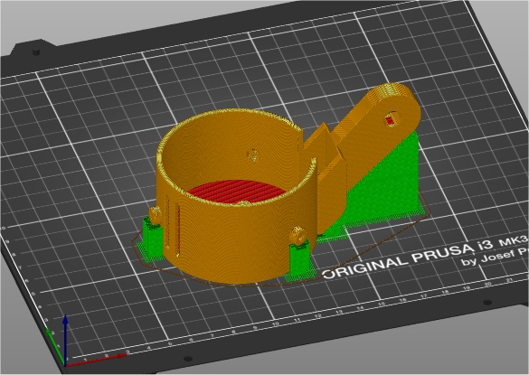
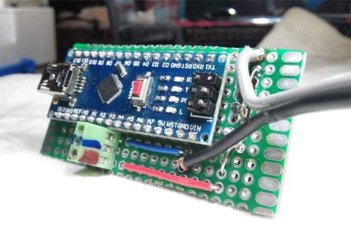
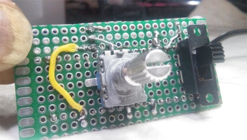

## 3D PRINTED FAN with Brushless Motor

I live on a sailboat in the tropics.  A good working 12V fan is more than a luxury, it is a necessity.  They get used for 8, 12, or more hours per day, and apart from just the sheer wear and tear from so much use, they are also usually subject to high humidity and salty sea air.  I have 7 such fans on the boat (it's a big boat, with 3 cabins).   One in each of the guest cabins, two in the master cabin, two in the salon, and one over the stove that works as an exit fan to a nearby window. So, if the fans only last 6 months ... well, you can see that you will be replacing a lot of fans!

For over 10 years I have struggled to get a good working 12V fan at anything resembling a reasonable price.

Such fans for boats (and RVs) come in basically two genres:

* super cheap fans, that aren't even worth the effort
* expensive boutique fans that don't satisfy expectations

Basically you can get cheap fans with brushed motors and cheap steel or plastic housings, or expensive ones that don't seem to me to be worth the money. If you are interested in more details, here's a link to my "survey of existing fans" page: [Survey of Existing Fans](survey.md)

But now that I have a 3d printer I was able to design **my own fan**, and I think it came out pretty good.

## MY SOLUTION

I went on ebay and bought a good brushless motor with dual ball bearings for $12.74.  To that I added a $3 arduino nano (which was really overkill for the project), a $1 rotary controller, a 50 cent switch, a little circuit board, and some wire, and designed and printed this fan.

The motor I chose was a Nidec 48F704K.   It seemed to have about the right specs for rpms and amperage at 12V.  They are actually a bit big for the fan I designed.  My fan has 180mm/7" blades and this motor could easily push 9" blades, but I wanted one that fit basically with the footprint of the "standard" fan I am replacing (which has 6" blades).

  **$12.74 on ebay**

I went through several design iterations, first on the fan blade, and then also on the shroud. Here's a pic of an early prototype.  Notice the bench power supply to the left, the laptop with fusion360 running and my Prusa 3d printer in the background.  With this setup I was able to test the fan at various voltage and to monitor and measure the current consumption:

I was surprised at how much (negative) effect the shroud had on the performance.   I started with a heavy shroud that printed in one piece.  It took 11 hours to print, with supports!   That was for the birds!   I redesigned it (a) to be much thinner and less obtrusive to the airflow, and (b) so that it could be printed in an hour or two, though it needs assembly. 

I had already (quickly) learned that it was better to print the blade itself in pieces and assemble it.   Printing it in one piece took a long time (like 8-10 hours), and (b) did not allow for replacing a single blade should one break.

Let me also add that this is **NOT THE FINAL effort** in this matter!  I have purchased more additional, and different types of brushless motors on Ebay and am looking forward to refining and generalizing the mounting etc.

## SLICING and PRINTING

All the STL files are in the [STL subdirectory](stl/).  I have provided the [Fusion 360 files](fusion/) as well.

I print almost everything at **0.30mm layer heights**, in "draft" quality on the Prusa, except the blads, which I printed at the Prusa 0.20mm "quality" setting.

I try to orient all the parts so that they are strongest in the required directions.  For the blade, to minimize the amount of supports, I print them on edge, as shown below:

I print all the rings for the shroud in one go, with the slots facing upwards as shown below.

and the motor body, with supports, as shown below:

The rest of the parts (bracket, struts, etc) are generally printed laying flat, or in whichever orientation makes the most sense.

## The Circuit

For the PWM motor control circuit, I simply used an Arduino Nano.  This was nice because I could hook it up directly to the boat's 12V system (which actually varies from about 12V upto 14.00V while charging) and it in turn could provide 5V that I could use with the rotary controller and for the PWM control signal to the motor.   Even so, it is overkill, so future designs will probably be based on the AT-TINY13 8 pin MPU with a dedicated 12V regulator, which sounds complicated but is actually less expensive ($1 vs $3) compared to the arduino and physically much smaller.

I already had pins on the nano, so I just soldered a few of them to the underlying circuit board.   

This is a common circuit available elsewhere on the net ... and I don't feel like redrawing it!  It is basically used as the cannonical example of how to hook up a rotary controller to the arduino.  Instead of powering an LED, I just attach it to the PWM inputs to the motor instead:

Note that there are no additional components (resistors) on the circit.  I take advantage of the built in pull-up resistors on the nano and just connect the rotary controller and fan directly to nano pins!

By the way ... the on-off switch completely cuts of power to the fan and nano ... it is not a "software" switch.  The fan draws **no power** when it is not turned on.

Finally, the Arduino sketch I am using is available [here](ino/).  In the future I will probably forgo the rotary control and save 50 cents and just use a 5K pot with a voltage divider ....

## Summary

I have mounted the fan in the master cabin.  I usse it every night, all night long. It is quiet, it hums nicely, and puts out volumnous amounts of air.   It is using about 0.7 amps ... slightly less than half the power of the cheap "standard" fan, and puts out about twice as much air.  I will check back in a year and see how it is handingling the wear and tear.

I'm calling this a **SUCCESS!**

