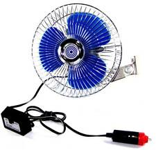
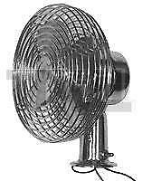
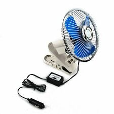
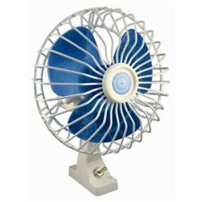
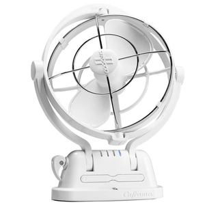
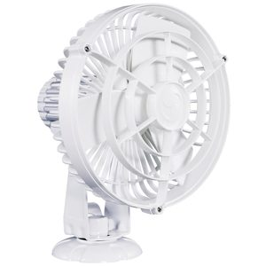
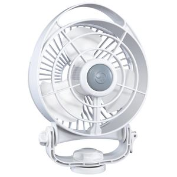
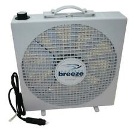

# Survey of existing fans

## Not Recommended

 Here are pics of some I definitely don't recommend.  All of these use brushed motors which have a maximum lifetime of about 6 months under heavy use.  They vary in price from about $15 to $50, and are always the same, regardless of the price you pay.

They used to make the first kind below with just an on/off switch, which was better, but in any case, the bracket is very cheap, and it rusts, and now, with the separate control box, you have to mount TWO things every time you have to change one of these cheap fans.  I hate em!

The second one, with a chromed mild steel housing and aluminum blades rust and make a lot of noise.  They typically come with a 2 speed controller that usually fails after about 2 months.  The blades are terribly inefficient and the controllers get VERY hot.  In fact, one of them almost caught on fire once on the boat.  I woke up to the smell of ozone and a black mark was burned into the headliner of the boat when the fan failed. I have one now (probably the fourth of these I've had) that barely works and will soon be replaced with a 3d printed (or other*) fan.  You can get this fan for $20, or you can pay $47 for the same fan. Doesn't matter.

The last one has no permanent mounting bracket, and is just a variant of the 1st one.

## The "standard fan" I ended up using

So, over the years, I had "standardized" down to a fan that looks like this:

 **The "Standard" fan I have been using**

These fans have a vinyl coated mild steel shroud, and a plastic case with a oscilatting mechanism and a power switch.  They can be had from $25 upto about $60.  Same fan. $60 from West Marine, $25 on ebay.  The oscilating mechanism itself makes a lot of noise, as well as causing it to jam at times, and so usually I end up disassembling the fan and removing it. The brushes last between 6 months and year at most, but before they completely wear out you will have usually disassembled and re-assembled the fan at least once to clean the insides, which get covered with carbon dust, and to correct the alignment of the brushes, which, due to the design, tend to wear in such a way that they jam when they are about 1/2 worn out.

These fans move a reasonable amount of air, and use between 1 and 1.6 amps at 12V ...

## Expensive "boutique fans"

Here's some pics of some of the other commonly available "boutique" fans for boats.  Notice the hefty prices:

  **$125 !!!**
  **$145 !!!**
  **$95 !!!**

I have never been able to justify shelling out that kind of money for a small 12V fan.  They are more expensive mostly. I think, because they use brushless motors and because they are marketted specifically to boaters.  Add "boat" to the description of an item and it costs twice as much!  I'm not kidding ... I've seen the exact same alternator for a motor sold for $50 for cars, and $125 for boats!  In regards to fans, I'm pretty sure these fans are better than the cheap ones, but I don't think they are worth the amount being charged.

## Endless Breeze

Finally, for completeness, there is one fan that I DO sort of recommend, if you have room on the boat for it, and are willing to spend $120+ for a fan.  That is the "Endless Breeze" 12V fan from dometic.   I have seen them on ebay from about $110 to $160:

  **$110+**

This fan is big, about 15"x15"x4" and is not really appropriate for mounting on a wall above a berth or in a small cabin, but it works well, is quiet, and seems like it will last forever, so it *may* be appropriate for a boat.   Definetely handy to have.

